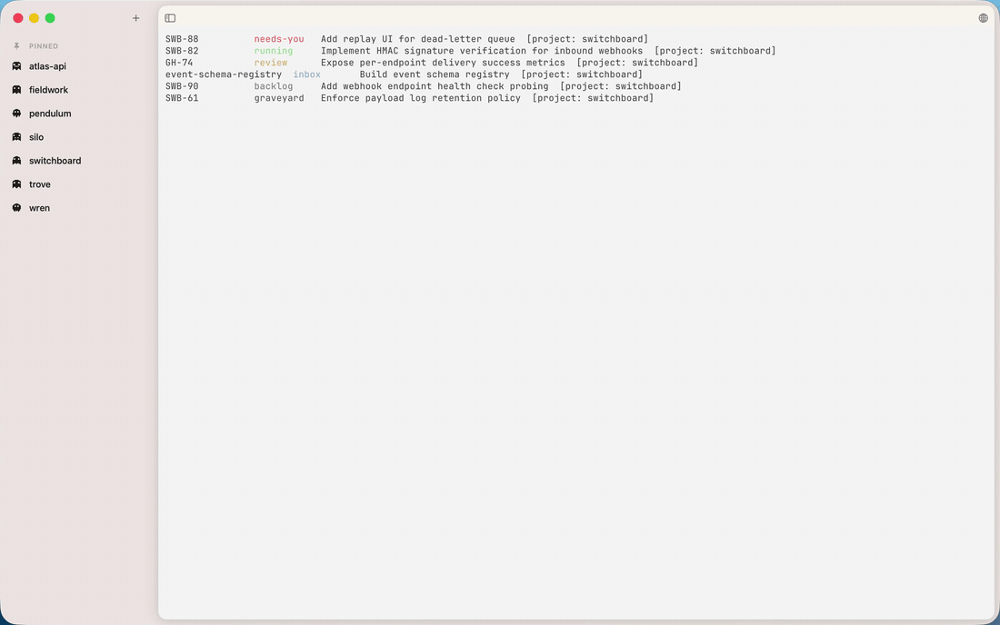

# Ghostties

**A terminal for running several AI agents at once. A fork of [Ghostty](https://github.com/ghostty-org/ghostty).**

> **Pre-1.0.** Active development, ships as a beta. Things move, and occasionally break.

## The problem

Running one coding agent is fine. Running five is a mess of terminal windows where you can't tell which one is working, which one is waiting on you, and which one finished twenty minutes ago while you were looking somewhere else.

Ghostties puts them in one window, grouped by project, and shows you what each one is doing.

## What it adds

Ghostty's terminal, with a workspace layer on top.

- **A project sidebar.** Sessions and tasks grouped by project, so a window full of agents stays readable.
- **Status at a glance.** Every task shows whether it's running, waiting on you, in review, or parked.
- **`gt`, a CLI.** Create and move tasks from inside any agent session, so an agent can file its own work.
- **An MCP server.** Agents read and update the task list directly.
- **An embedded browser.** The thing you're building, next to the thing building it.

Everything else is Ghostty, unmodified: the terminal, the renderer, fonts, config, keybindings, shell integration.

## Install

Download the latest `.dmg` from [Releases](https://github.com/SeanSmithWorks/ghostties/releases), drag it to Applications, open it. It updates itself after that.

Requires **macOS 13 or later on Apple Silicon**. There's no Intel build and no Linux build.

### First launch

macOS will ask for access to Desktop, Documents, and iCloud Drive. That's standard for any new terminal. The prompts come from commands running inside the terminal, not from Ghostties. Deny anything you don't need. To stop them entirely, grant Full Disk Access in System Settings, under Privacy & Security.

The dialogs say "Ghostty" rather than "Ghostties" because they use the bundle identifier inherited from upstream.

## Its relationship to Ghostty

Ghostties is a fork of [Ghostty](https://github.com/ghostty-org/ghostty), the terminal emulator built by [Mitchell Hashimoto](https://github.com/mitchellh) and the Ghostty contributors. Ghostty is the original, and the reason this exists. The terminal, its performance, and nearly all of this repository's source are its work. Ghostties adds a sidebar.

This fork is not affiliated with or endorsed by the Ghostty project.

That distinction matters when something breaks. If the problem is the terminal itself, meaning rendering, fonts, config syntax, keybindings, or escape sequences, it's an upstream issue and belongs at [ghostty-org/ghostty](https://github.com/ghostty-org/ghostty/issues), where it gets fixed for every Ghostty user. If it's the sidebar, `gt`, the MCP server, or updates, [file it here](https://github.com/SeanSmithWorks/ghostties/issues).

Please don't take Ghostties bugs to the Ghostty maintainers. They didn't ship this.

And if you want the terminal without the agent workspace, you want [Ghostty](https://ghostty.org). It's excellent. Go use it.

## Documentation

- [CONTRIBUTING.md](CONTRIBUTING.md). How to report things, and what happens with pull requests.
- [TESTING.md](TESTING.md). Running the test suites.
- [HACKING.md](HACKING.md). Building from source.
- [SECURITY.md](SECURITY.md). Reporting a vulnerability privately.

Terminal configuration is documented at [ghostty.org/docs](https://ghostty.org/docs). Ghostties uses the same config.

## License

[MIT](LICENSE).

Copyright © 2026 Sean Smith. Copyright © 2024 Mitchell Hashimoto and the Ghostty contributors.

Ghostties bundles other people's software: the Chromium Embedded Framework, and Sparkle. Their licenses and notices are in [THIRD-PARTY-NOTICES.md](THIRD-PARTY-NOTICES.md).
